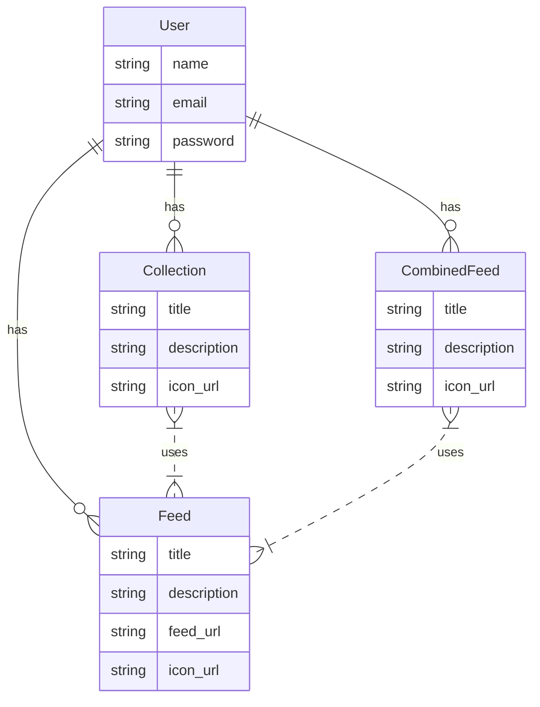

# RSS Feed

This is a simple utility to manage RSS feeds for your reading pleasure.

## Installation

This project manages its underlying development system dependencies with [asdf](https://asdf-vm.com/guide/getting-started.html#_2-download-asdf).

In addition to `asdf`, you must install some Erlang [prerequesites](https://github.com/asdf-vm/asdf-erlang#before-asdf-install).

On Ubuntu and Debian it's the following:
```sh
apt-get update
apt-get -y install libncurses5-dev \
                   build-essential \
                   autoconf \
                   xsltproc \
                   fop \
                   libxml2-utils \
                   inotify-tools
```

Once `asdf` and its necessary dependencies are installed you will need to add the Erlang and Elixir plugins and then install the project's specific versions
```sh
asdf plugin add erlang
asdf plugin add elixir
asdf install
```

This will leverage the `.tool-versions` file to install the currently required versions of Elixir and Erlang. 

## App

To start the server:

  * Install dependencies with `mix deps.get`
  * Create and migrate your database with `mix ecto.setup`
  * Start Phoenix endpoint with `mix phx.server` or inside IEx with `iex -S mix phx.server`

Now you can visit [`localhost:4000`](http://localhost:4000) from your browser.

## Data Model



Inspecting the data model at the database level:
```sh
docker-compose exec db psql -U postgres -d rss_dev
```